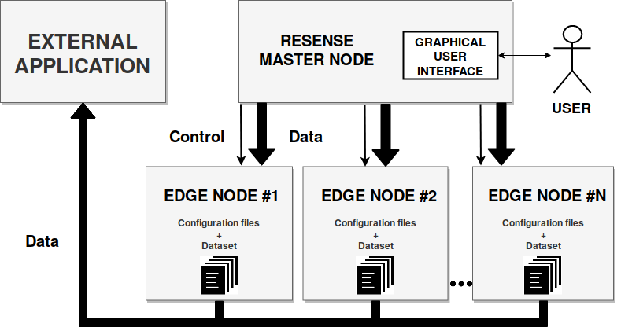
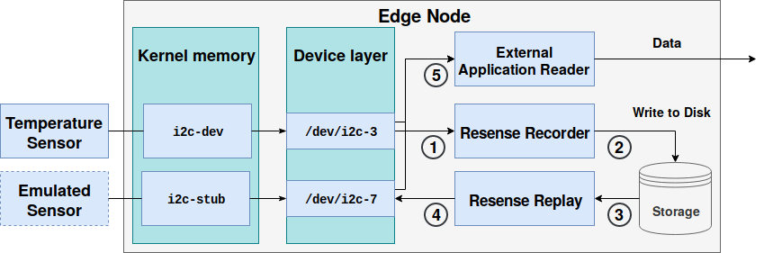

# Resense: Transparent Record and Replay of Sensor Data in the Internet of Things
The repository for Resense, a framework for recording and replaying sensor-based data.

### Features:
- Transparently emulate sensors.
- Setup IoT experiments involving large numbers of heteregeneous sensors.
- Record live data and replay them on top of emulated sensors.
- Augment existing workflows with rarely ocurring event data.

### Resources:
- Paper: [Resense: Transparent Record and Replay of Sensor Data](publication/resense.pdf)
- Poster: [download](publication/edbt-resense-poster.pdf)
- BibTeX citation:
```
@inproceedings{giouroukis2019resense,
  title={Resense: Transparent Record and Replay of Sensor Data in the Internet of Things},
  author={Giouroukis, Dimitrios and H{\"u}lsmann, Julius and von Bleichert, Janis and Geldenhuys, Morgan and Stullich, Tim and Gutierrez, Felipe Oliveira and Traub, Jonas and Beedkar, Kaustubh and Markl, Volker},
  booktitle={22nd International Conference on Extending Database Technology (EDBT)},
  year={2019}
}
```

## Demo Introduction
This demonstration allows the user to get familiar with the capabilities of Resense and provide a good user experience.

You can test Resense with different configurations for different experiments (and data).

## Setup

Resense assumes a Linux host OS and a Raspberry-based SBC for running emulated sensors.
It is recommended to use the latest release version of [Raspbian](https://www.raspberrypi.org/downloads/raspbian/).
For the host as well as the remote node, it is recommended to install Java.

### Build instructions
- `mvn clean package`
- `java -jar resense-dashboard/target/snapshot-jar-path`
- visit [http://localhost:9000/dashboard](http://localhost:9000/dashboard)

The provided configuration will handle the dependencies for the project as well as bundling the kernel module driver for emulating sensors.

## Technical Overview
In this section, we will give a brief overview of the general architecture and then a more focused example
on the design behind a node running in Resense.

### General architecture


Users can control Resense through the graphical user interface of the master node. 
From there, users can deploy sensor data to sensor nodes, replay and record data, and monitor the progress of experiments. 
For external applications it is transparent whether they read data which originates from physical or emulated sensors.

### Edge node internals


Three applications operate on top of physical and emulated sensors in our example: 
- Resense Recorder, 
- Resense Replay, and 
- a reader of an external application. 

The applications act as follows: The Resense Recorder reads sensor values ① and stores them for later use ②. 
This allows for capturing events in order to replay them later on. The Resense Replay module can read the sensor values 
stored by the recorder ③ and replay them through the emulated sensor ④. We consider this process a replay of an experiment. 
The external application reader can access all sensors (the physical temperature sensor and the emulated sensor) in the same way ⑤.

## Resense at EDBT 2019
Resense was first introduced at the 22nd International
Conference on Extending Database Technology (EDBT) in March 2019.

**Abstract**: As the scientific interest in the Internet of Things (IoT) continues
to grow, emulating IoT infrastructure involving a large number
of heterogeneous sensors plays a crucial role. Existing research
on emulating sensors is often tailored to specific hardware and/or
software, which makes it difficult to reproduce and extend. In
this paper we show how to emulate different kinds of sensors in
a unified way that makes the downstream application agnostic
as to whether the sensor data is acquired from real sensors or
is read from memory using emulated sensors. We propose the
Resense framework that allows for replaying sensor data using
emulatedsensorsandprovidesaneasy-to-usesoftwareforsetting
up and executing IoT experiments involving a large number
of heterogeneous sensors. We demonstrate various aspects of
Resense in the context of a sports analytics application using
real-world sensor data and a set of Raspberry Pis.

Acknowledgements: This work was supported by the German
Ministry for Education and Research as Berlin Big Data Center
(01IS14013A) and the European Union’s Horizon 2020, under the
Marie Skłodowska-Curie grant agreement No 765452.
